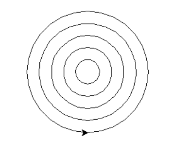

开始学习Python

# 安装PyCharm 2023.1.1 (Commnunity Edition)
## 下载IDE: pycharm-community-2023.1.1.exe
## 下载解释器(interpreter): python-3.9.13-amd64.exe
# 学习python turtle 库
```python
import turtle
for i in range(5):
    turtle.penup()
    turtle.goto(0, -20*(i+1))
    turtle.pendown()
    turtle.circle(20*(i+1))
turtle.done()
```
## 如下图所示

* [Python Turtle库详解](https://blog.csdn.net/qq_37806690/article/details/123135451)
* [python--turtle库（纯干货教程)](https://zhuanlan.zhihu.com/p/571871736)
* [Python绘图Turtle库详解](https://blog.csdn.net/zengxiantao1994/article/details/76588580/)
* [奥运五环](https://zhuanlan.zhihu.com/p/515839216)